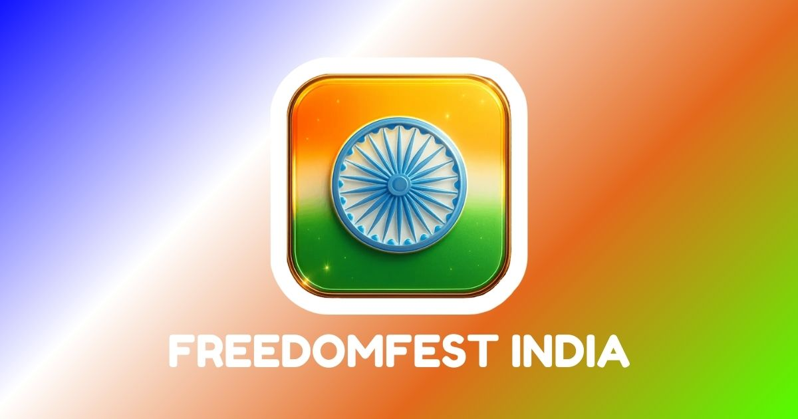

# 🇮🇳 FreedomFest India — Independence Day Celebration 2025

**FreedomFest India** is a modern, responsive, and SEO-optimized website celebrating **India’s Independence Day 2025**.  
It showcases **history, culture, patriotic events** and delivers a **fast, mobile-friendly, share-ready** experience.

🌐 **Live Website:** [https://freedomfestindia.netlify.app](https://freedomfestindia.netlify.app)  

---

## 📸 Preview

---

## ✨ Features
- 📱 **Responsive Design** — Works flawlessly on all devices  
- ⚡ **Fast & Optimized** — Minimal load times with clean code  
- 🏷 **SEO Ready** — Meta tags, Open Graph, and Twitter Cards  
- 🇮🇳 **Patriotic Theme** — Custom tricolor styling & animations  
- 🔗 **Social Media Share Optimized** — Perfect previews on WhatsApp, Facebook, Twitter  
- 🌍 **Hosted on Netlify** — Reliable & fast CDN delivery  

---

## 🛠 Tech Stack
- **HTML5** — Structure
- **CSS3** — Styling & animations
- **JavaScript (Vanilla)** — Interactivity
- **Netlify** — Hosting & deployment
- **Open Graph / Twitter Cards** — Social sharing

---

